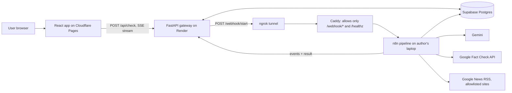

# NarrativeGuard

**Check a forwarded message before you share it.**

Paste a WhatsApp or social-media message. NarrativeGuard shows what professional fact-checkers and trusted news say about it, which manipulation tactics it uses, how it differs from the verified fact, and how to reply, always with cited sources. When there is not enough evidence, it says **"Unverifiable"** instead of guessing.

- **Live app:** https://narrativeguard-live.pages.dev
- **API:** https://narrativeguard-2.onrender.com (`/health`, `/api/examples`)
- **Demo video:** https://drive.google.com/file/d/1ZaYZeLh8TwywpnSpwi1oZzZjPLDmHzLc/view?usp=sharing

> **Please read (for judges):** the live analysis pipeline runs on the author's own laptop (n8n, exposed through a tunnel). If the laptop is offline, the app shows a banner and the **Examples** page keeps working, because saved results are served straight from the database. See [Honest limits](#honest-limits).

---

## Why this exists

Rumours spread fastest on WhatsApp, where nobody can see the sources. NarrativeGuard puts the evidence next to the message so people can check, and learn to spot the tricks, before they forward it.

Design rules we kept:

- **No fake precision.** No "87% fake" score. The verdict is one of seven categories.
- **No evidence is not "fake".** "Unverifiable" and "Too new to verify" are deliberate, honest answers.
- **The AI never decides the verdict.** The AI labels evidence; plain code applies fixed rules.
- **Every claim is cited.** Each source shows its tier, how it relates to the claim, and a link to the original publisher.

---

## What you get on a result page

| Section | What it shows |
|---|---|
| Verdict card | Category, "Based on ..." line, "as of" time, "what would change this", forward advice (Don't forward / Wait / Safe to share with source) |
| Red flags | Manipulation tactics found in the message, with the exact phrase highlighted |
| Diff view | The message versus the verified fact, with mutation labels (fabrication, reframing, exaggeration, omission, old news, false context) |
| Sources panel | Tier badge, relation (supports / contradicts / background / unrelated), snippet, link, and an open "sources disagree" banner when they do |
| Seen before | If a very similar message was checked earlier, you see it first and can choose "Check anyway" |
| Reply helper | A ready-made reply to the person who sent the message, with Copy and WhatsApp buttons |
| Share card | A downloadable or shareable image with the verdict, the verified fact and the source |
| Examples | Saved real results that work even when live analysis is offline |

### Verdicts

| Verdict | Rule (applied by code, not by the AI) |
|---|---|
| **Contradicted** | A tier 1 or 2 source directly contradicts the claim, or at least two independent tier 3 sources contradict it |
| **Supported** | At least two independent reliable sources support it |
| **Misleading** | The facts are real, but evidence shows distortion (reframing, omission, false context, old news) |
| **Disputed** | Credible sources contradict each other |
| **Too new to verify** | Breaking event with only early or single-source reporting |
| **Unverifiable** | Not enough evidence, or the AI output failed validation |
| **Not checkable** | Opinion or prediction, so there is no fact to check |

Source tiers: **1** official, **2** professional fact-checkers, **3** wire services and established outlets, **4** everything else (a signal only, never evidence).

---

## Architecture



**Request flow**

1. The browser sends the message and a Turnstile token to `POST /api/check`.
2. FastAPI redacts phone numbers and emails, normalizes the text, and looks for an exact cache hit, then for similar earlier messages ("seen before").
3. On a cache miss, FastAPI checks that n8n is reachable, creates a job, and triggers the n8n workflow.
4. n8n runs the pipeline and posts a progress event at each stage, then the final result, back to FastAPI.
5. The browser follows progress over Server-Sent Events (with a polling fallback) and shows the result.

**The n8n pipeline** (workflow "Main analysis")

```
Webhook -> A1 Claim Analyst (Gemini Flash-Lite) -> validator -> route
   check:           Fact Check API | archive search (Postgres) | allowlisted news  (parallel)
                    -> Evidence Builder (code: dedupe, tiers, cap 8, IDs E1..E8, old-news check)
                    -> A2 Evidence Analyst (Gemini Flash) -> validators + one retry
                    -> Verdict Engine (code) -> result
   opinion/no claim -> fallback verdict ("Not checkable" / "Unverifiable")
```

- Two LLM calls per check. Plain REST calls with structured JSON output; the LLM has no tools and no network access, and user text is passed as delimited data (prompt-injection resistant).
- Validators check that every cited evidence ID exists, that snippets really appear in the source item, and that highlighted spans really appear in the message. If validation fails twice, the result falls back to **Unverifiable**.
- A separate ingestion workflow pulls fact-checker RSS feeds into the archive every 3 hours.

### Sources (all free)

- **Google Fact Check Tools API** (live lookup)
- **Fact-checker RSS archive:** Alt News, Factly, Vishvas News, Newschecker (searchable with Postgres full-text and trigram search)
- **Google News RSS**, restricted to allowlisted domains: PIB, The Hindu, Indian Express, NDTV, Hindustan Times, Times of India, The Print, Reuters, BBC
- Only titles, short snippets, dates and links are stored; every item links back to the original publisher. Alt News content is CC BY 3.0 and is attributed.

---

## Tech stack

| Layer | Choice |
|---|---|
| Frontend | React, TypeScript, Vite, Tailwind CSS, React Router, `html-to-image` (hosted on Cloudflare Pages) |
| Gateway | FastAPI, asyncpg, httpx (hosted on Render free tier) |
| Database | Supabase Postgres (plain Postgres via the pooler, `pg_trgm`, Alembic migrations) |
| Pipeline | n8n (Docker) behind Caddy, exposed with ngrok |
| LLM | Google Gemini (free tier) |
| Abuse protection | Cloudflare Turnstile, per-IP limits, global daily cap |
| Monitoring | UptimeRobot pings `/health` to keep Render and Supabase awake |

---

## Public API

| Endpoint | Purpose |
|---|---|
| `POST /api/check` | Submit `{text, lang?, force?, turnstile_token?}`. Returns a cached result, a "seen before" payload, or a new `job_id` |
| `GET /api/jobs/{id}` | Job status, result and stored events |
| `GET /api/jobs/{id}/stream` | Server-Sent Events: `stage`, `result`, `failed` (replays stored events on connect) |
| `GET /api/examples` | Saved example results (work without n8n) |
| `GET /health` | Health check |

Errors use `{"detail": {"code", "message"}}` with codes `invalid_input`, `captcha_missing`, `captcha_failed`, `captcha_unavailable`, `ip_hour`, `ip_day`, `global_day`, `n8n_offline`.

Internal endpoints used by n8n (`POST /internal/jobs/{id}/events` and `/result`) require the shared secret header `X-Webhook-Secret`. The full contract is in [`docs/contract.md`](docs/contract.md).

Progress stages: `started`, `claim_analysis`, `factcheck_search`, `archive_search`, `news_search`, `evidence_built`, `evidence_check`, `verdict`.

---

## Safety, privacy and abuse protection

- Phone numbers, emails and ID-style numbers are **redacted before storage or analysis**. Raw messages are not kept; the stored text is the redacted version.
- User-supplied URLs are **never fetched** (no SSRF surface).
- LLM nodes have no tools or network access; messages and evidence are wrapped as data; the verdict is decided by code.
- n8n's editor is **never public**: Caddy forwards only `POST /webhook/*` and `GET /healthz` through the tunnel. Calls between services use a shared secret header compared in constant time.
- Per-IP limits (hour and day), a global daily cap below the Gemini quota, and Cloudflare Turnstile. Client IPs are stored only as salted hashes.
- CORS allows only the exact frontend origins. Row-level security is enabled on all tables.
- A job watchdog fails jobs that stall, so the UI never hangs.
- Free-tier Gemini prompts may be used by Google to improve its models. This is shown to users on the home and About pages.

---

## Run it locally

### Prerequisites

Node 20+, Python 3.12+, Docker Desktop, an ngrok account, a Supabase project, and the API keys listed below.

### 1. Environment variables (names only; never commit values)

Copy `.env.example` to `.env` at the repo root and fill it in.

| Variable | Used by |
|---|---|
| `DATABASE_URL`, `MIGRATION_DATABASE_URL` | FastAPI (transaction pooler), Alembic (session pooler) |
| `WEBHOOK_SHARED_SECRET` | FastAPI and n8n (header `X-Webhook-Secret`) |
| `N8N_WEBHOOK_URL` | FastAPI (`https://<ngrok-domain>/webhook/start`) |
| `N8N_HEALTH_URL` | optional override for the n8n health check |
| `ALLOWED_ORIGINS` | FastAPI CORS (comma-separated, exact origins, no trailing slash) |
| `TURNSTILE_SECRET_KEY`, `TURNSTILE_SITE_KEY` | FastAPI (secret), frontend (site key) |
| `IP_HASH_SALT`, `LIMIT_IP_HOUR`, `LIMIT_IP_DAY`, `LIMIT_GLOBAL_DAY` | FastAPI abuse protection |
| `JOB_IDLE_SECONDS`, `JOB_MAX_SECONDS`, `MAX_INPUT_CHARS` | optional FastAPI tuning |
| `GEMINI_API_KEY`, `GOOGLE_FACT_CHECK_API_KEY` | n8n credentials only |
| `NGROK_AUTHTOKEN`, `NGROK_DOMAIN`, `N8N_ENCRYPTION_KEY` | n8n stack |
| `VITE_API_URL`, `VITE_TURNSTILE_SITE_KEY`, `VITE_USE_MOCK` | frontend build (public values only) |

### 2. Database

```bash
cd backend
pip install -r requirements-dev.txt
alembic upgrade head          # creates tables, archive search function, indexes
```

Seed data for the source registry is in `backend/db/`.

### 3. Backend (FastAPI)

```bash
python -m venv .venv
source .venv/bin/activate     # Windows: .venv\Scripts\Activate.ps1
pip install -r backend/app/requirements.txt
cd backend/app
uvicorn main:app --reload
```

Tests: `cd backend/app && python -m pytest tests -q`.

### 4. n8n pipeline

```bash
docker compose -f n8n/docker-compose.yml --env-file .env up -d
ngrok http --url=https://<your-ngrok-domain> 8080
```

Open `http://localhost:5678`, create the credentials (Gemini key header, webhook secret header, Postgres, Fact Check query key), import the workflows from `n8n/`, and **publish** "Main analysis". Exported workflow files contain no credentials.

### 5. Frontend

```bash
cd frontend
npm install
npm run dev
```

Set `VITE_USE_MOCK=true` in `frontend/.env.local` to run the whole UI on built-in sample data without any backend.

---

## Deployment

| Part | Where | Settings |
|---|---|---|
| Backend | Render web service | Root directory `backend/app`, build `pip install -r requirements.txt`, start `uvicorn main:app --host 0.0.0.0 --port $PORT`, health check `/health` |
| Frontend | Cloudflare Pages | Build `npm run build` in `frontend`, output `dist`, env vars `VITE_*` and `NODE_VERSION=20`. Vite bakes env vars in at build time, so rebuild after changing them |
| Database | Supabase | Session pooler for migrations, transaction pooler for the app |
| Pipeline | The author's laptop | Docker Compose + ngrok (see above) |

Direct frontend deploy with Wrangler:

```bash
cd frontend
npm run build
npx wrangler pages deploy dist --project-name narrativeguard-live
```

---

## Repository layout

```
backend/
  app/            FastAPI app: main.py, db.py, intake.py, cache.py, guard.py,
                  n8n.py (availability gate + dispatch), job_watchdog.py, routers/, tests/
  alembic/        database migrations
  db/             source registry seed data
  scripts/        test and helper scripts (fake n8n events, internal API tests, limit tests)
frontend/
  src/            pages (Home, Result, SeenBefore, Examples, SavedExample, About),
                  components (progress, verdict card, red flags, diff, sources, reply + share card),
                  lib (api, types, mock data)
n8n/              docker-compose.yml, Caddyfile, exported workflows
docs/             contract.md (webhook and API contract)
```

---

## Honest limits

- **The live pipeline depends on a laptop** (power, Wi-Fi, Docker, tunnel). If it is down, the app says so and the saved examples still work.
- **Free-tier AI limits.** Gemini's daily quota can run out; the result then falls back to "Unverifiable" with an explanation instead of a made-up answer.
- **Coverage is limited.** Sources are mostly English and Hindi; very new or very local rumours may not be covered; Bengali is only partly supported (the interface renders Bengali, but few Bengali sources are indexed).
- **Fact-checks can match the topic but not your exact claim.** The AI step checks whether a fact-check really matches the claim, and fact-checks that do not match are downgraded to background.
- **The AI can make mistakes.** Validators catch fabricated citations and snippets, but not every wrong judgement. This is not legal, medical or financial advice.
- Render's free tier sleeps after idle time, so the first request can take up to a minute.

---

## Roadmap

- AI-written replies with tone and language options (the reply helper currently uses a template)
- "Spot it yourself" mode: pick the red flags before they are revealed
- More fact-checker feeds and Bengali sources
- Move the pipeline to an always-on host

---

## Credits

- Fact-checking data: Google Fact Check Tools API and RSS feeds from Alt News (CC BY 3.0), Factly, Vishvas News and Newschecker; news headlines via Google News RSS. All items link back to the original publisher.
- Built by Subhankar (GitHub: [subhankarkhatua27](https://github.com/subhankarkhatua27)). NarrativeGuard v2 is a rebuild of an earlier hackathon prototype.

To report a wrong verdict, [open an issue](https://github.com/subhankarkhatua27/NarrativeGuard/issues/new).